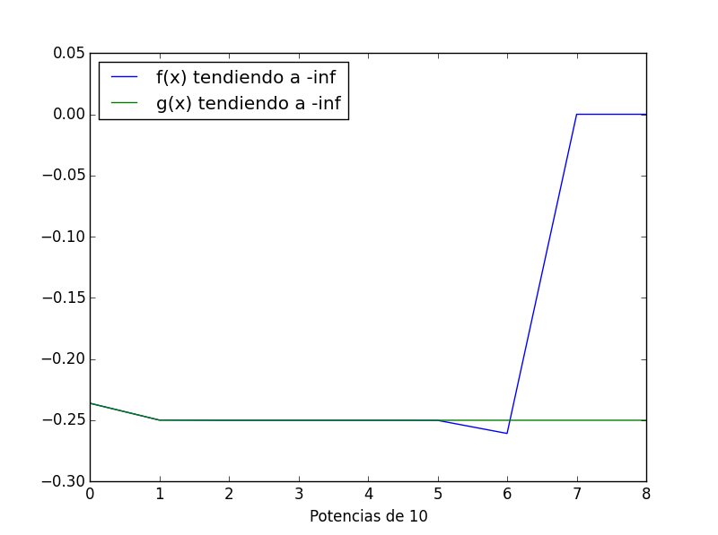

# MCOC-Proyecto-0
MCOC-Proyecto-0

# Introducción
===============

En este proyecto de podrá encontrar información respecto de la perdida de significancia en cálculos de límites de funciones.

# Ejemplo
===============

Si tomamos la función: 

    f(x) = x(sqrt(4x**2+1)+2x)

Luego estudiamos su límite cuando x tiende a infinito negativo y cuando tiende a 0 para verificar la importancia de la cantidad de cifras significativas con la que se trabaja.
A continuación, se presenta un a imagen donde se grafica la función. Aquí se puede apreciar que el límite cuando x tiende a infinito negativo es -0,25. 

Sin embargo, mediante el mismo codigo de python al crear una lista de números con los exponentes de -10 simulando la tendencia de x hacia el infinito negativo se tiene que el limite es igual a 0. Esto claramente muestra un error de calculo relacionado con la perdida de significancia que sufren los numeros al someterse a calculos en maquinas ya que evidentemente en como se muestra en la figura el resultado del límite debió dar -0.25. En la siguiente imagen se puede apreciar la tendencia de x mientras avanza hacia infinito negativo con un paso de potencias de 10, es decir de -10 a -10^2 a -10^3, etc.

Para solucionar este problema, se debe trabajar la función f(x), multiplicando tanto el numerador como el denominador por un uno conveniente:
    
    x(sqrt(4x**2+1)+2x) * (sqrt(4x**2+1)-2x)/(sqrt(4x**2+1)-2x)
    
De esta manera, simplificando términos queda una nueva función a la que llamaremos g(x) la cual es equivalente a función previamente definida, pero es más fácil de procesar para la máquina.

    g(x) = x/(sqrt(4*(x**2)+1)-2*x)
    
En la imagen a continuación se verifica que ambas funciones son equivalentes.

Aplicando límite a la nueva funcion se tiene el siguiente gráfico donde se muestra el avance que tiene x mientras esta va tendiendo a infinito negativo.

Con esto, se puede corroborar que el límite de la función siempre fue -0,25 y que por un error de significancia este se vió alterado.

